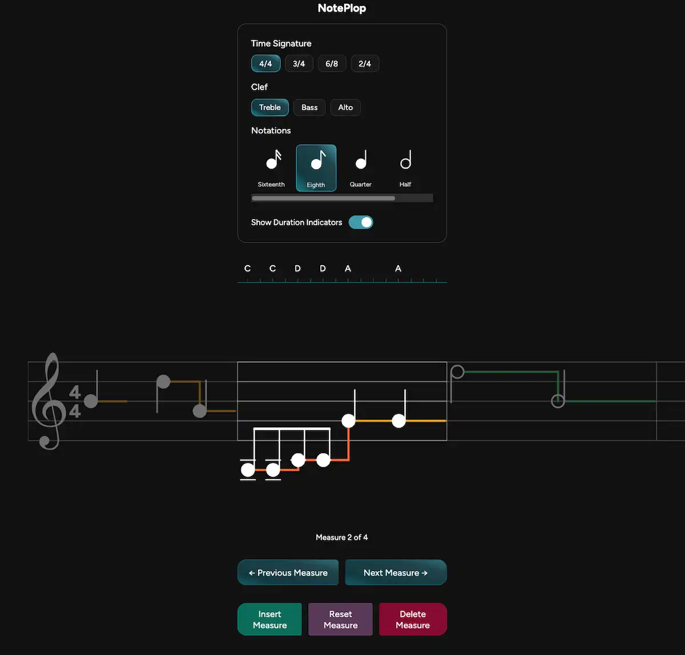

noteplop
=======

A small React + TypeScript + Vite app for interactively placing musical notes on a staff.

What it runs on
---

- Built with: `Vite`, `React`, `TypeScript`, and `Sass`.
- Recommended runtime: `Bun` (or Node.js v16+).

Getting Started
---

1. Install dependencies:

   - With Bun: `bun install`

2. Start the dev server:

   - With Bun: `bun run dev`

3. Open your browser at `http://localhost:5173`.

Build / Preview
--

- Build: `bun run build`
- Preview production build: `bun run preview`

What it does
---

Interactive UI for composing/placing notes on a musical staff (the NotePlopper component).

